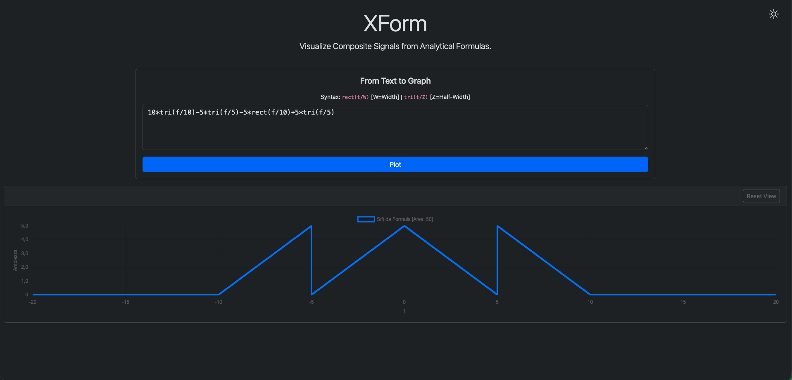

# [XForm](https://gabrielerandazzo.github.io/XForm/)  
A web-based interactive tool to visualize composite signals made of rectangular (`rect`) and triangular (`tri`) functions.   It parses a mathematical expression, generates the corresponding waveform, and plots it dynamically using Chart.js.

## Why?

This project was created as a **personal study tool** for understanding and visualizing concepts from *Signal Theory*.  
When learning about signals, it can be challenging to correctly translate between a **mathematical expression** and its **graphical representation** — or vice versa.  
By building this tool, I wanted to create an interactive way to verify my intuition: writing a formula and instantly seeing the resulting waveform, or checking whether a plotted shape matches its analytical form.

Rectangular and triangular functions are **fundamental building blocks** in signal processing and Fourier analysis.  
They often represent time- or frequency-domain components used to model filters, pulses, and modulation envelopes.

- The **rectangular function** `rect(t/w)` equals 1 when `|t| ≤ w/2` and 0 otherwise.  
  It models a time- or band-limited signal and has a sinc-shaped Fourier transform.

- The **triangular function** `tri(t/w)` is defined as `1 - |t|/w` for `|t| ≤ w`, and 0 otherwise.  
  It can be seen as the convolution of two rectangular pulses, resulting in smoother transitions and a squared sinc transform in frequency.

By combining and scaling these elementary signals with different amplitudes, centers, and widths, this tool allows the visualization of **composite spectral shapes**, illustrating how signals add up linearly in Fourier synthesis and how their analytical forms relate to their graphical behavior.

## Contributing

Contributions are welcome. If you’d like to improve XForm, fix a bug, or add a new feature, feel free to open an issue or submit a pull request.

## License

Released under the **MIT License**.  
Feel free to use, modify, and share for educational or personal projects.
